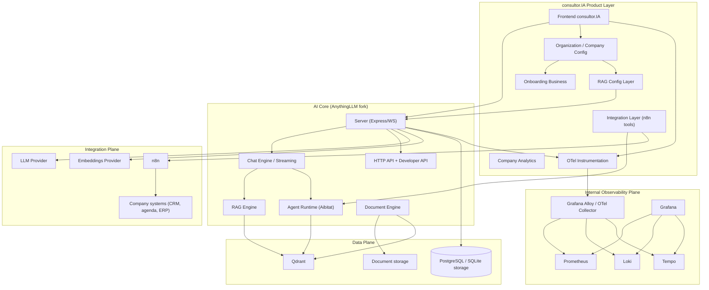

# 04 - Target Architecture

## Princípio

AnythingLLM continua sendo o **AI Core**. consultor.IA adiciona product layer (Organization, onboarding, RAG config, integrações, analytics, observabilidade) sem reescrever o core.

## Decisões estruturais

1. **Um deployment por empresa no MVP** (`ADR-003`): A/B/C independentes; máxima simplicidade de rollback/isolação.
2. **Qdrant por empresa** (`ADR-004`): cada deployment tem seu Qdrant; collection por workspace.
3. **n8n é integration layer** (`ADR-005`): não é engine de RAG; consultor.IA chama webhooks n8n via tools allowlisted/assinados.
4. **Observabilidade compartilhada** com labels de segmentação `organization_id`, `deployment_id`, `environment`, `service`.
5. **App fala OTLP** (`ADR-001`): não conhece Loki/Tempo/Prometheus; Alloy faz roteamento.
6. **Sem multi-tenancy sofisticado**: dados por empresa separados fisicamente; contrato de dados prepara evolução.

## Componentes alvo

| Component | Papel |
| --- | --- |
| consultor.IA Product Layer | UX, empresa, config, integrações, analytics, segurança |
| AI Core (AnythingLLM) | chat, RAG, agentes, documentos, providers, API |
| Qdrant | vector storage por empresa |
| n8n | integrações de negócio |
| OTel SDK | traces, metrics, structured logs |
| Alloy | recebe OTLP, roteia |
| Prometheus/Loki/Tempo/Grafana | storage e visualização internos |
