# 05 - Deployment Architecture (3 empresas)

## Decisão

- 3 deployments independentes do consultor.IA (Company A, B, C).
- Cada deployment: server/frontend/collector + Qdrant + database/storage próprios + opcional n8n.
- Observability stack compartilhada (um Alloy/OTel Collector por deployment; backends centrais compartilhados), segmentada por labels.

```mermaid
flowchart TB
  subgraph CompanyA["Company A - deployment-a"]
    A1["consultor.IA A (server + frontend + collector)"]
    A2["Qdrant A"]
    A3["DB / storage A"]
    A4["n8n A (optional)"]
  end

  subgraph CompanyB["Company B - deployment-b"]
    B1["consultor.IA B (server + frontend + collector)"]
    B2["Qdrant B"]
    B3["DB / storage B"]
    B4["n8n B (optional)"]
  end

  subgraph CompanyC["Company C - deployment-c"]
    C1["consultor.IA C (server + frontend + collector)"]
    C2["Qdrant C"]
    C3["DB / storage C"]
    C4["n8n C (optional)"]
  end

  subgraph Obs["Shared Observability Stack"]
    ALLOY_A["Alloy/Collector A"]
    ALLOY_B["Alloy/Collector B"]
    ALLOY_C["Alloy/Collector C"]
    PROM["Prometheus"]
    LOKI["Loki"]
    TEMPO["Tempo"]
    GRAFANA["Grafana"]
  end

  A1 --> A2
  A1 --> A3
  A1 --> A4
  B1 --> B2
  B1 --> B3
  B1 --> B4
  C1 --> C2
  C1 --> C3
  C1 --> C4

  A1 -- "OTLP labels: org=a, deployment=a" --> ALLOY_A
  B1 -- "OTLP labels: org=b, deployment=b" --> ALLOY_B
  C1 -- "OTLP labels: org=c, deployment=c" --> ALLOY_C
  ALLOY_A --> PROM
  ALLOY_A --> LOKI
  ALLOY_A --> TEMPO
  ALLOY_B --> PROM
  ALLOY_B --> LOKI
  ALLOY_B --> TEMPO
  ALLOY_C --> PROM
  ALLOY_C --> LOKI
  ALLOY_C --> TEMPO
  GRAFANA --> PROM
  GRAFANA --> LOKI
  GRAFANA --> TEMPO
```



## Isolamento físico

| Recurso | Strategy | Evidência/Justificativa |
| --- | --- | --- |
| Database | um Postgres (ou SQLite) por deployment; dados A/B/C nunca no mesmo schema | `ADR-003`; hoje `server/prisma/schema.prisma:12` usa sqlite |
| Qdrant | um Qdrant por deployment; collection por workspace | `ADR-004`; `server/utils/vectorDbProviders/qdrant/index.js:117` usa namespace = workspace.slug |
| Document storage | `STORAGE_DIR` por deployment | `docker/.env.example:2`; `server/endpoints/api/document/index.js:19` |
| Cache/vector cache | por deployment | `server/utils/files/index.js` cache de embeddings |
| Secrets | env vars por deployment; secret manager opcional | `server/.env.example` |
| Logs/metrics/traces | central compartilhado, mas com labels obrigatórios | `ADR-001` |
| Backups | snapshot por deployment (DB, Qdrant, documents, config) | runbook em `17-mvp-done.md` |
| Rede | cada deployment em rede própria; n8n e business APIs aprovados | `09-security-model.md` |

## Rollback

- Cada empresa tem artefato/versão imutável (Docker image tag ou commit).
- Restore de empresa = restaurar DB, Qdrant, documents e configuração do deployment correspondente.
- Se apenas uma empresa estiver com problema, o rollback não afeta as outras.

## Observability segmentation

Todos os dados de observabilidade carregam:

```text
organization_id=<slug|uuid>
deployment_id=<deployment-a|deployment-b|deployment-c>
environment=<staging|production>
service=<consultor-ia|collector|qdrant|n8n|alloy>
```

`organization_id` e `deployment_id` são labels de baixa cardinalidade e fazem parte do schema de logs/traces (ver `11-metrics-spec.md`, `12-logging-spec.md`, `13-tracing-spec.md`).
