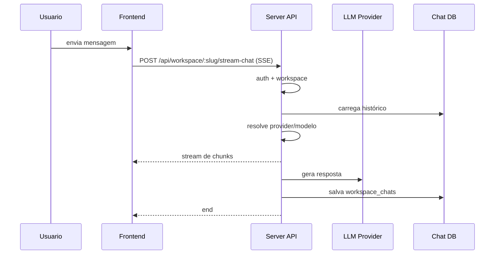
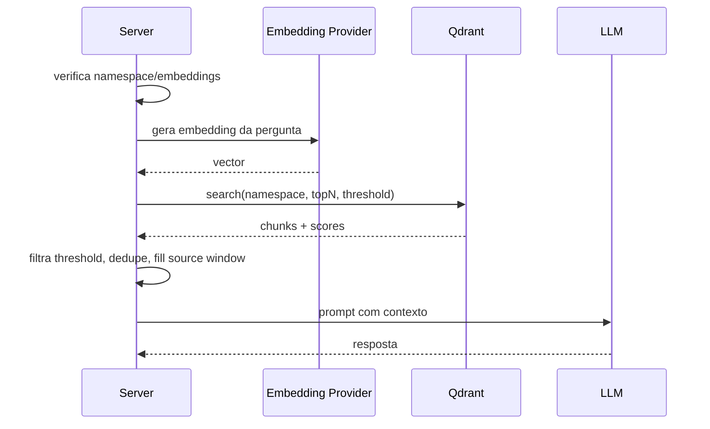
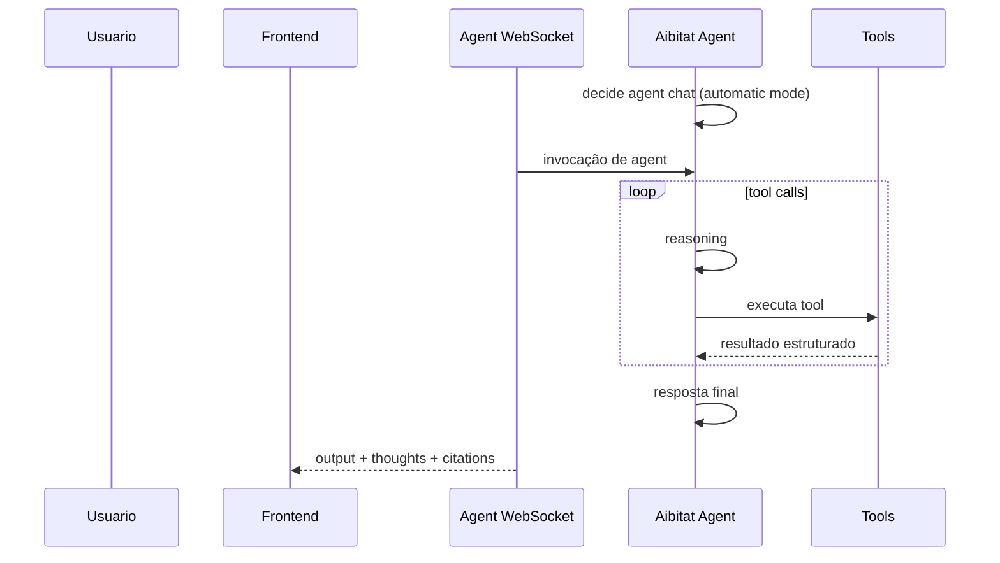
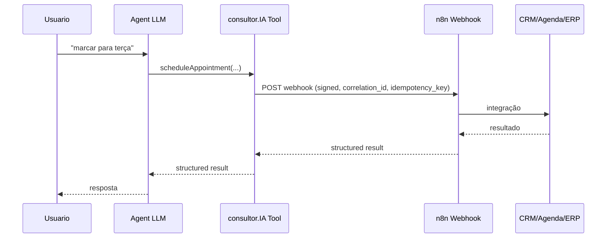
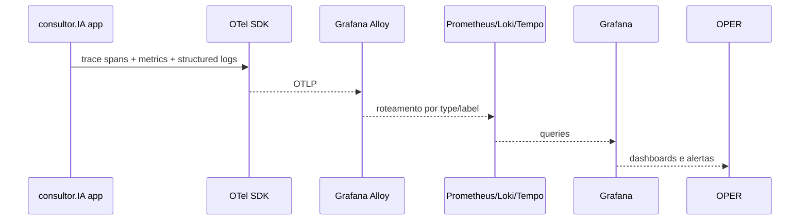

# 06 - Data Flows

## Chat Flow

Evidência: `server/endpoints/chat.js:22`, `server/utils/chats/stream.js:24`, `server/models/workspaceChats.js:10`.

## RAG Flow

Evidência: `server/utils/chats/stream.js:187`, `server/utils/vectorDbProviders/qdrant/index.js:117`, `server/utils/vectorDbProviders/base.js:122`.

## Agent Flow

Evidência: `server/utils/chats/agents.js:51`, `server/utils/agents/index.js:54`, `server/endpoints/agentWebsocket.js:27`.

## Tool Flow

- Agent recebe tool list via `WORKSPACE_AGENT.getDefinition()` (`server/utils/agents/defaults.js:56`).
- Tools default: memory, doc-summarizer, web-scraping (`server/utils/agents/defaults.js:15`).
- Whitelist/approval: `server/endpoints/agentSkillWhitelist.js`, `server/models/agentSkillWhitelist.js`, `server/utils/agents/imported.js:178`.
- Tool perigoso: `api-call` de agent flows faz `fetch(url)` arbitrário (`server/utils/agentFlows/executors/api-call.js:42`). Alvo: restringir a allowlist/assinatura.
- Search tools: web-browsing chama SerpAPI/SearchAPI/Tavily etc conforme env (`server/utils/agents/aibitat/plugins/web-browsing.js:96`).

## n8n Flow (alvo)

Contrato detalhado em `08-integration-contracts.md`.

## Document Ingestion Flow

1. Usuário envia arquivo/link no frontend (`frontend/src/components/Modals/ManageWorkspace/Documents/UploadFile/index.jsx`).
2. Server recebe upload e chama Collector (`server/endpoints/api/document/index.js:120`, `server/utils/collectorApi/index.js:121`).
3. Collector verifica integridade (`collector/middleware/verifyIntegrity.js:9`), processa (`collector/processSingleFile/index.js`, `collector/processLink/index.js`) e retorna parsed documents.
4. Documento é salvo/embedido em workspace (`server/models/documents.js`, `server/jobs/embedding-worker.js:60`).
5. Embeddings: `server/utils/EmbeddingEngines/*`; vector write: `server/utils/vectorDbProviders/qdrant/index.js:196`.
6. Observability: `document_ingestion_*` metrics + trace `document.ingest` (alvo).

## Observability Flow

Evidência atual: não há OTel; logs atuais em `server/utils/logger/index.js`, `server/middleware/httpLogger.js`, `server/models/eventLogs.js`.

## Feedback Flow

1. Frontend tem thumbs up/down (`frontend/src/components/WorkspaceChat/ChatContainer/ChatHistory/HistoricalMessage/Actions/index.jsx:55`).
2. API grava `feedbackScore` em `workspace_chats` (`server/endpoints/workspaces.js:538`, `server/models/workspaceChats.js:266`).
3. Schema atual: booleano (`server/prisma/schema.prisma:193`).
4. Alvo PR 10: adicionar `reason`/categorias e correlacionar com trace/conversation/model/RAG config.
