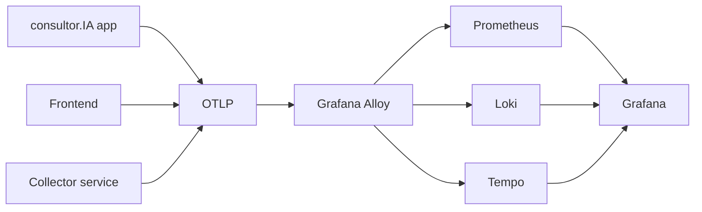

# 10 - Observability Architecture

## Stack

| Layer | Tool | Justificativa |
| --- | --- | --- |
| Instrumentation | OpenTelemetry SDKs (Node.js) | padrão aberto, spans/metrics/logs, evita lock-in |
| Collector | Grafana Alloy | coleta OTLP e roteia para Prometheus/Loki/Tempo; mais simples de operar com Grafana; não substitui OTel protocol |
| Metrics | Prometheus | padrão, já integrado a Grafana |
| Logs | Loki | logs estruturados com labels |
| Traces | Tempo | traces distribuídos |
| Visualização | Grafana | dashboards/alertas |
| Frontend observability | OTel Web SDK | RUM próprio, sem SaaS externo (opcional no MVP) |

### Alloy vs OTel Collector puro

- **Alloy**: recomendado. Menos componentes, config declarativa, integração nativa com Grafana, mantém OTLP na entrada.
- **OTel Collector puro**: viável, mas adiciona mais operação para o mesmo valor no MVP.
- App não conhece backends; app envia OTLP para `OTEL_EXPORTER_OTLP_ENDPOINT`.

## Componentes

## Implementação mínima (PR 02)

1. `@opentelemetry/api`, `@opentelemetry/sdk-node`, `@opentelemetry/exporter-trace-otlp-http`, `@opentelemetry/exporter-metrics-otlp-http`.
2. Bootstrap `server/utils/observability/otel.js`: Resource attributes, HTTP instrumentation, metrics reader, propagator W3C.
3. Request middleware: gerar `request_id`, propagar `trace_id`, criar root span por request.
4. Logger estruturado: substituir `winston`/console por JSON com campos obrigatórios.
5. Coleta de métricas de infra (CPU/RAM/disk) via `process`/`check-disk-space` ou exporter.

## Correlation IDs

- `trace_id` e `span_id`: OTel.
- `request_id`: UUID por HTTP request.
- `conversation_id`: `workspace_threads.slug` ou `workspace_chats.thread_id`.
- `organization_id`: do deployment/organization.
- Propagação: `traceparent` para n8n; headers próprios para business APIs.

## Instrumentation points

| Ponto | Tipo |
| --- | --- |
| HTTP server | trace + metric |
| Chat request | span `chat.request` |
| RAG retrieval | span `rag.retrieval` |
| Qdrant | span `qdrant.search` |
| Embedding | span `embedding.generate` |
| LLM generation | span `llm.generate` + metrics |
| Agent | span `agent.reasoning`, `tool.call`, `n8n.webhook` |
| Document ingestion | span `document.ingest` |
| Background jobs | span `job.run` |

## Sensitive Debug Mode

- Desligado por padrão.
- Habilita captura de prompts, respostas e chunks em logs/traces.
- Temporário (`DEBUG_EXPIRES_AT`), auditável (`debug_mode_enabled` event), restrito a admin.
- Retenção curta (ex.: 1h) e sem persistência em Loki/Tempo default.
- Alvo PR 09; PR 02 deixa schema com campos opcionais.
